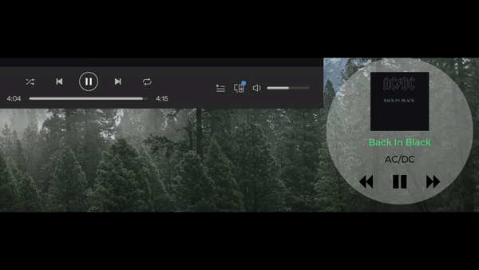

## Übersicht Spotify mini player and ad silencer widget

First of all I would like to thank [Felix](https://github.com/felixhageloh) for the great work on creating Übersicht and keeping it updated day after day.

**Features**

1. See the name, artist and album image of the current Spotify track in the desktop.
2. Play/pause the current Spotify track from the desktop.
3. Go forward the next Spotify song from the desktop.
4. Go backward the previous Spotify song from the desktop.
5. The widget automatically detects the ads and silence Spotify so you don't have to listen to them.
6. When the widget detects that a song is being resumed after an ad, it turns up again the volume to the latest volume set in Spotify.

**The widget**

**Installation**

1. Download **Übersicht** from the [official web page](http://tracesof.net/uebersicht/).
2. Unzip the download and open the **Übersicht.app** file. You should see a Getting Started widget in the center of your desktop.
3. Download the *Spotify-AdSilencer.widget.zip* file, unzip and put the uncompressed folder in the following location `/Users/\<username>\/Library/Application Support/Übersicht/widgets`
4. Enjoy :)

**Final thoughts**

1. If you are thinking in using this widget as an ad silencer all the time, you should considering in upgrading your Spotify account to premium in order to support the great service Spotify offers.
2. Spotify is a registered trademark of Spotify Ltd. This repo is in no way affiliated with spotify.com or Spotify Ltd.